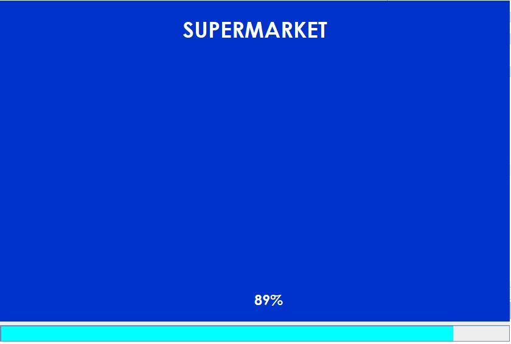
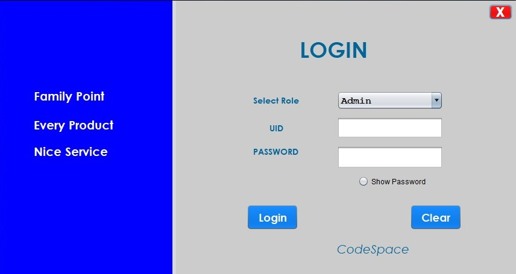
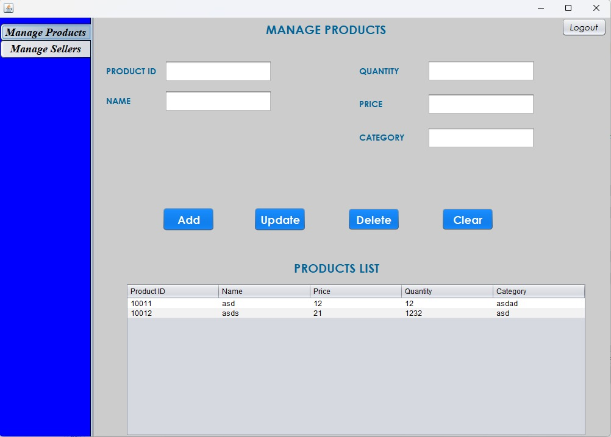
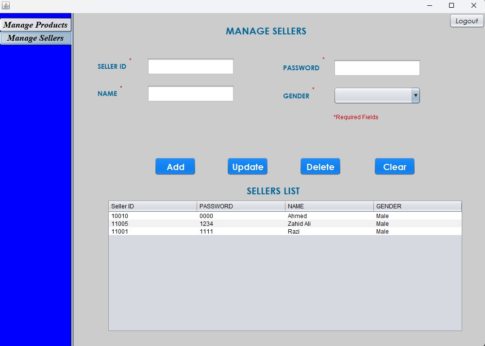
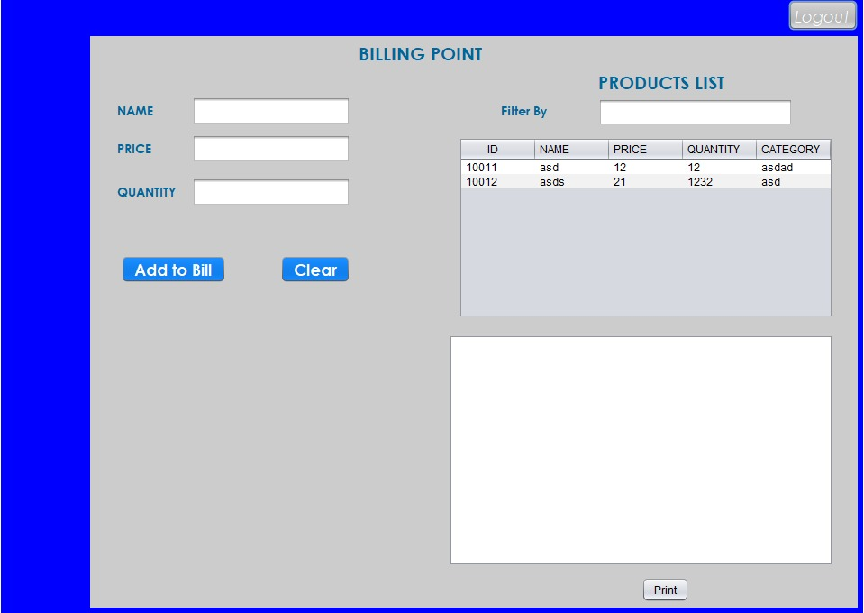

# Supermarket Management System
A Java based GUI Management System for a Supermarket implemented using Object-Oriented Programming concepts and File Handling. Developed using NetBeans and JDK 19.
### Admin Credentials
UID: Group1  
Password: Project

>> These credentials are hard coded can be found in Login.java file.

### Seller Credentials
 UID: 10010  
 Password: 0000 

>> These credentials are stored in Directory root folder named as Seller.txt.

## PROJECT PREVIEW

### Loading Page

### Login Page
<!--  -->

### Login As

1. Admin
2. Seller

## Admin Login

### Manage Products

### Manage Sellers

## Seller Login

### Seller Dashboard
<!--  -->

